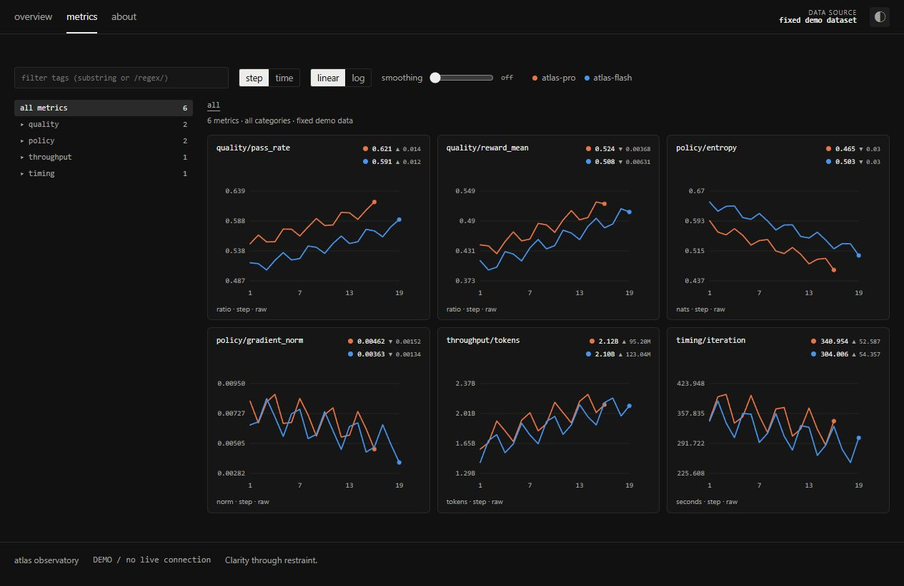

# Quiet Observatory UI

一个可复用的前端设计 skill：将**克制、高密度、精密科研监控台**的视觉语言，转成可执行的设计与交互规范。

适合训练监控、实验追踪、系统观测、评估对比及需要这一审美的数据产品。支持已有项目，不要求特定框架。



## 它提炼了什么

- **视觉**：中性深浅双主题，1px 边框，6px 小圆角，低对比网格，紧凑留白。
- **排版**：无衬线 UI＋等宽数据，约 20px 关键值，完整指标路径，稳定的数字对齐。
- **结构**：整条运行状态面板、共享分隔的统计单元、统一小图网格、左侧指标目录。
- **交互**：目录下钻、过滤、轴切换、平滑、取点、大图详情和返回上下文。
- **品质**：真实数据语义、错误与空状态、移动布局、键盘操作和实际浏览器验收。

这些规则来自 2026-09-17 对原站概览、指标、详情、主题与窄屏的观察。文档区分**实测值、观察结果、复用建议和未验证内容**。

## 下次直接这样说

无需安装，给智能体仓库链接与具体需求：

> 阅读 https://github.com/yanqiyang62/quiet-observatory-ui 的 SKILL.md，按它的设计系统、交互规范和验收标准，为我做一个【你的产品】前端。保留我现有的技术栈与业务内容，完成后在浏览器检查桌面和手机效果。

已安装为 skill 时：

> 使用 $quiet-observatory-ui，为我的【实验管理系统】制作前端，使用真实业务结构，达到该 skill 的视觉与交互验收标准。

不需要重复解释“高级感”。技能里包含具体参数、组件配方与反例；最终质量仍需要结合实际内容迭代验收。

## 安装到 Codex

本仓库根目录就是完整 skill 文件夹。将整个仓库放到个人 skills 目录，目录名保持 `quiet-observatory-ui`。如果配置了 `CODEX_HOME`，使用该路径下的 `skills`。

macOS / Linux：

```sh
git clone https://github.com/yanqiyang62/quiet-observatory-ui.git ~/.codex/skills/quiet-observatory-ui
```

Windows PowerShell：

```powershell
git clone https://github.com/yanqiyang62/quiet-observatory-ui.git "$env:USERPROFILE\.codex\skills\quiet-observatory-ui"
```

也可使用你的智能体支持的 GitHub skill 安装功能安装本仓库。安装后在能发现该 skill 的会话中用 `$quiet-observatory-ui` 调用。无需先安装演示工程的依赖。

## 文件入口

| 文件 | 用途 |
| --- | --- |
| [SKILL.md](SKILL.md) | 智能体执行入口与工作流 |
| [design-system.md](references/design-system.md) | 配色、字体、密度、布局、组件与响应式 |
| [interactions.md](references/interactions.md) | 图表、过滤、详情、数据状态与键盘契约 |
| [source-observations.md](references/source-observations.md) | 来源、观测记录与推断边界 |
| [quality-bar.md](references/quality-bar.md) | 可执行验收标准 |
| [tokens.css](assets/tokens.css) | 可复用双主题 CSS 变量 |
| [starter](assets/starter/index.html) | 原创、无依赖、可交互样例 |

## 打开示例

直接用浏览器打开 `assets/starter/index.html`，或在仓库根目录启动任意静态服务器后访问 `/assets/starter/`。例如安装有 Python 时：

```sh
python -m http.server 4173 --bind 127.0.0.1
```

示例包括两条虚构 run、六个指标、目录分类、子串／正则过滤、step／time、linear／log、EMA 平滑、取点、详情和原始数据表。无网络请求、无训练连接、无随机实时数字。样例不是生产数据层；完整采样日志、批次组成和大数据性能需按实际任务扩展。

已通过 skill 结构校验与 JavaScript 语法检查；在桌面和 390px 窄屏实际检查了深浅主题、分类、正则／无结果／无效表达式、坐标切换、平滑、详情数据表、Esc 返回和焦点恢复。未进行生产接口或大规模数据负载测试。

## 许可

原创说明与代码采用 [MIT License](LICENSE)。
